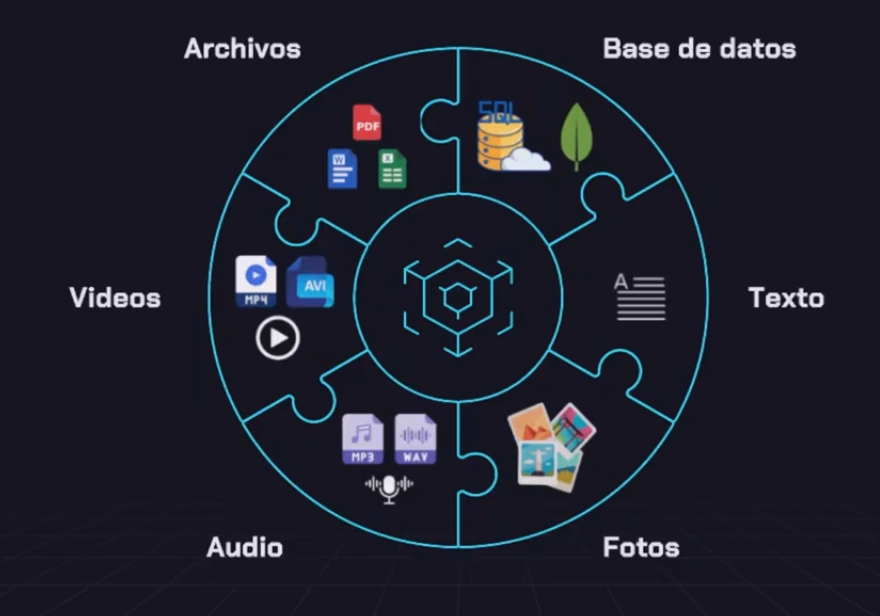
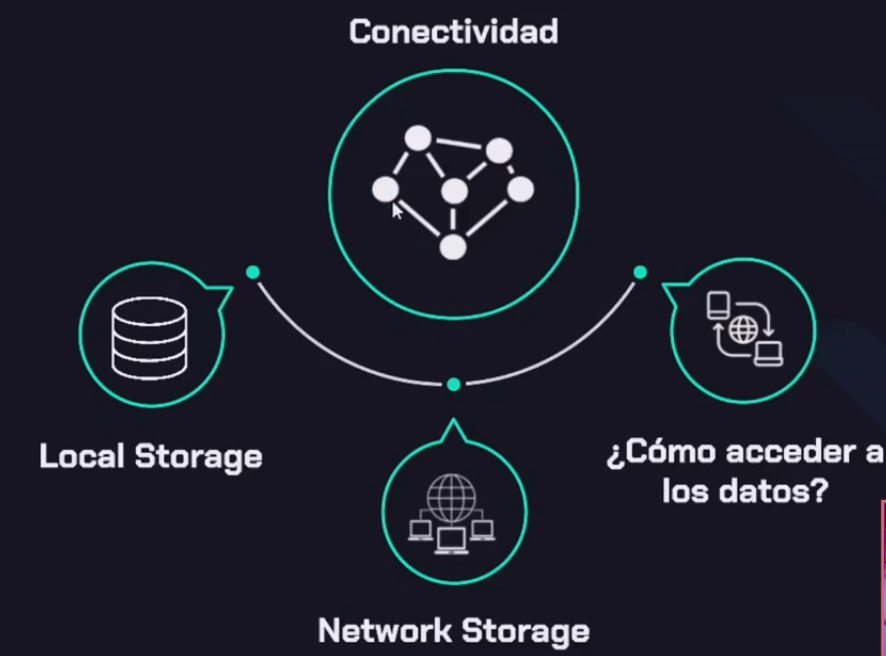
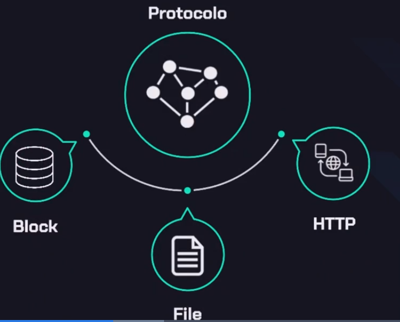
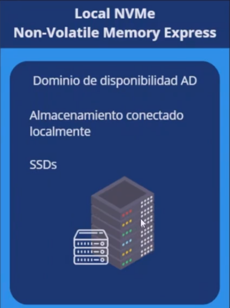
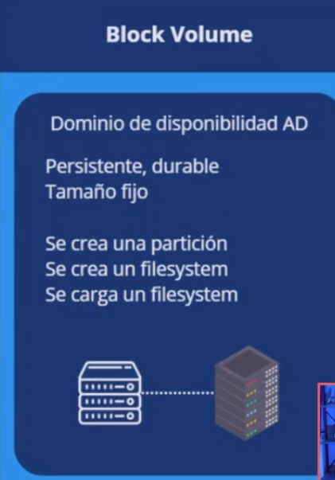
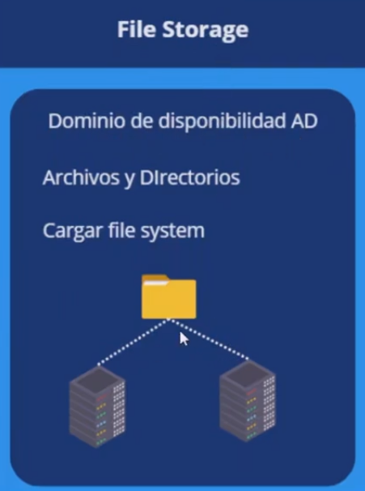
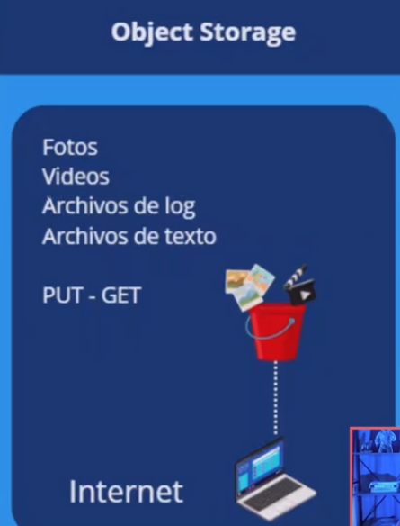
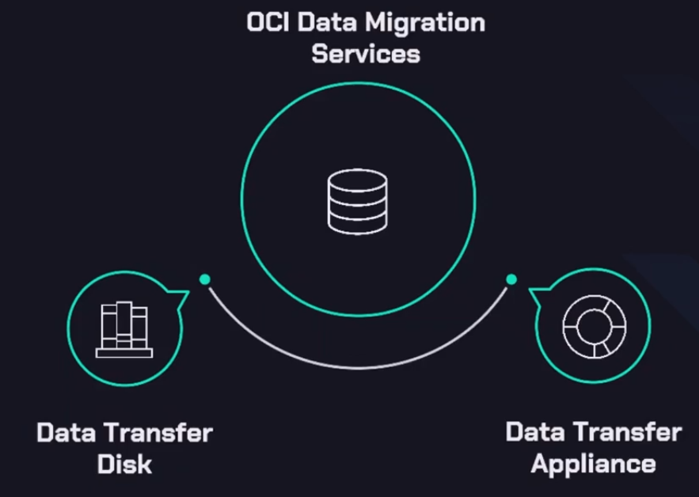
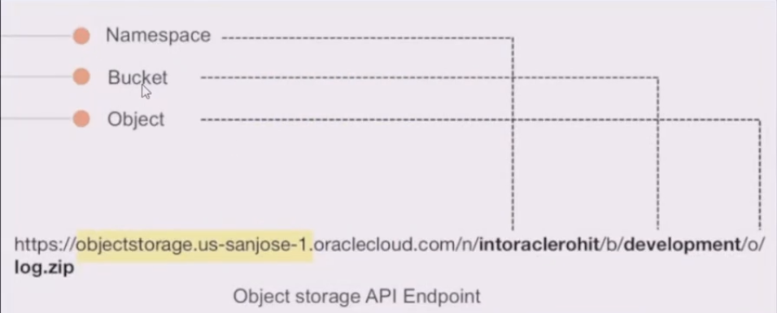

# noAlmacenamiento

## Introducción a Storage

1. Archivos
2. Bases de datos
3. Texto
4. Fotos
5. Audio
6. Videos

Datos Persistentes: datos que se necesitan mantener y cuidas

Datos No persistente: datos que se usan de manera temporal y no necesitan ser almacenados en el tiempo, se pueden borrar

### Rendimiento

- IOPs: Input/Output operations per second
- Capacidad de procesamient

### Persistente

- Almacenar los datos de manera segura

### Durabilidad

- Realizar multiples copias de los datos en caso de algún error en el almacenamiento, aun se tengan respaldos

## Conectividad a los datos

## Protocolo

## Local NVMe

- Dominio de disponibilidad AD
- Almacenamiento conectado localmente
- SSDs

## Block Volume

- Dominio de disponibilidad AD
- Persistente, durable
- Tamaño fijo
- Se crea una partición
- Se crea un filesystem
- Se carga un filesystem

## File Storage

- Dominio de disponibilidad AD
- Archivos y directorios
- Cargar file system

## Object Storage

- Fotos
- Videos
- Archivos de log
- Archivos de texto
- PUT-GET

## OCI Data Migration Service

1. Data Transfer Disk
2. Data Transfer Appliance

## OBJECT STORAGE

se almacenan en buckets o tobos

- almacenamiento de alto desempeño
- datos son almacenados como objetos, llave valor, key:value
- ideal para datos sin estructura 'unstructured'
- almacena contenido
- aplica para datos sin estructura o semi estructurado
- aplica en big data, spark, hadoop/ data analytics
- aplica para archivar o backups

Recursos:

Objeta + metadadata

Bucket: cubeta, balde, contenedor, tiene jearquia plana

namespace: contenedor logico para buckets

las supuestas carpetas son realmente para hacernos facil el orden ya que fisicamente no existen, por eso son jerarquicas planas.

ojo este dato es publico.

### Storage Tier.

Costos, los datos son cifrados por defecto

#### Nivel 1: Standar Access : HOT

- rapido, inmediato, acceso frecuente
- copia mas reciente de la info (hay versiones)
- recuperacion instantanea

#### Nivel 2: Infrecuente o Infrequent Access: COOL

- ideal para datos requeridos poco frecuentes
- tiempo minimo de retencion 31 dias
- $ cuota de recuperación

#### Nivel 3: Archive Storage: COLD

- datos rara vez accedidos
- retencion minima requerida 90 dias
- los objetos necesitan ser restaurados antes de ser descargados
- tiempo restauracion 1 hora
- tiempo de descarga 24 h

#### Nivel Auto Tiering

- oracle evalua y recomienda el nivel del archivo segun su frecuencia de uso

### OCI Object storage

- se usa bucket
- se puede habilitar encriptacion
- se pueden agregar etiquetas
- despues de crear el bucket se sube el objeto o archivo
- oci le agrega un prefijo, por ejemplo imagen... / parecen carpetas pero realmente son prefijos en oci
- se crea un url publico
- los *objetos* se suben por defecto en modo **privado**
- se puede habilitar la disponibilidad por tiempo y fechas o se edita la visibilidad para hacerlo publico
- se pueden definir politicas, politicas de replicas

## Block Volume

- no esta asociada a la instancia, los datos pueden persistir asi la instancia se borre
- los datos se crean y se vinculan, tambien se pueden desvincular
- se pueden conectar varias maquinas virtuales con acceso a estos datos

### Tiers para block volume

1. Lower cost: grandes cargas de trabajos secuenciales, 2 IOPS/GB, 2 gb por segundo
2. Balanced: equilibrio entre rendimiento y ahorro, sirve para la mayoria de las cargas de trabajo, 60 IOPS/GB
3. Higher performance: cargas de trabajo que requieren alto procesamiento, 75 IOPS/GB
4. Ultra High: para cargas de trabajo con los mayores requisitos de I/O 90/225 IOPS/GB

Auto TUNE:

- Existe auto-tune performance
- Se pueden cifrar
- cifrado en transito
- Se pueden replicar, migrar *asincrona*
- Se pueden agrupar
- se puede redimensionar up o down

OCI Block volume:

- menu storage
- se crea con un nombre
- puede ser por defecto o personalizado. por defecto 2024 gb, tope hasta 32 T

## File Storage

- almacenamiento de archivos
- es como un disco duro, aplica para windows, linux, mac
- servidores web
- se puede almacenar no solo archivos sino tambien configuraciones
- soporta NFSv3
- se pueden hacer snapshots de los datos
- se almacena cifrado con AES-256 y la transferencia en TLS
- en linux NFS
- en windows SMB
- acepta CRUD
- soporta hipervisores
