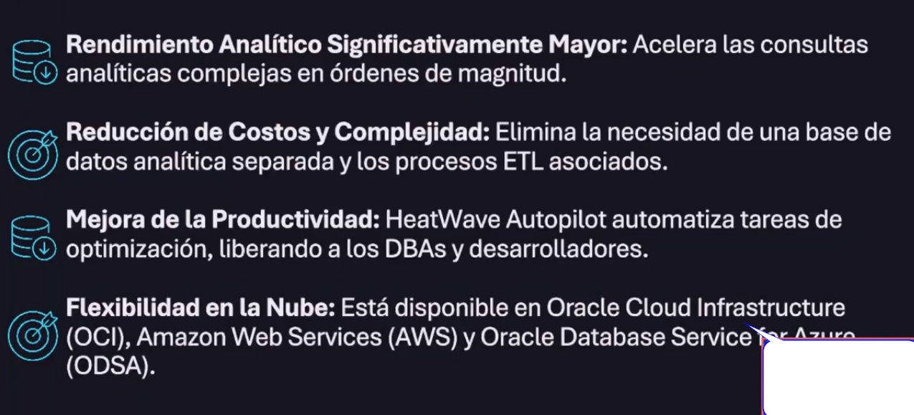

# Bases de Datos

Puedes ser los servidores de oracle o en la nube del cliente.

## Principales Servicios

Antes se debe tomar en cuenta:

- Dificultad en la administración y optimizacion
- Bajo desempeño y latencia alta
- Escalabilidad limitada
- Falta de automatizacion y seguridad

### 1. Oracle Autonomus DataBase

- servicio de bd automatizado, update,
- auto gestionado, self driving
- auto protegido y
- auto reparable en oci., se recupera automaticamente ante un fallo, garantiza 99.995 %
- se administra a si misma
- elastica, se puden escalar los recursos segun las necesidades

tipos de cargas que maneja

- ATP: autonomus transaction processing, para cargas transaccionales
- ADW: autonomus data wherehouse, para analisis de datos, data wherehousing y data lakes
- AJD: autonomus JSON Database, optimizado para el desarrollo de aplicaciones centradas en documentos json

### 2. Oracle Exadata Cloud Service

- producto de oracle
- forma de almacenar muchos datos
- mucha potencia

### 3. MySQL HeatWave

- motor mysql
- tiende a ser repetido
- es mas rapido y cuesta menos
- esta liberado y disponible en aws, azure

### 4. Bare Metal VM DB Systems y NoSQL

- paradigma nuevo
- solucion robusta escalable para aplicaciones que requieren flexibilidad de datos, alto rendimiento y disponibilidad, especialmente aquellas con grandes volumenes de datos y necesidades de respuesta rápida, la opcion del cloud service simplifica la gestion y reduce los costos operativos

NOSQL

## Oracle Base Database Service

- VM base de datos oracle enterprise edition y standar edition en OCI
- no complejidad en la administracion
- todo esta armado en la infraestructura
- exiten 4 opciones
  - standard edition
  - enterprise edition
  - enterprise edition high performance
  - enterprise editio extreme performance
- control total, eres root
- flexibilidad, en cpus, memoria, almacenamiento, puedes escalar
- cuenta con automatizacion ya definida por oracle, copias de seguridad, reduce la carga operativa de tu equipo IT
- opciones de licenciamiento o licencias propias BYOL trae tus propias licencias.

## ACID:

