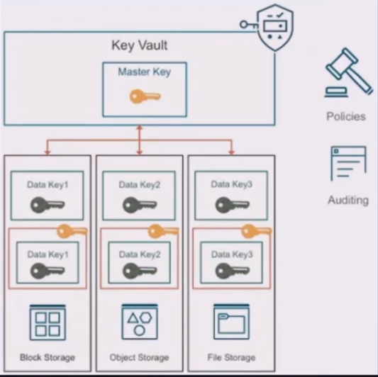

# Seguridad

- de infreaestructura

Shared security model

## 1. On-premises

- datos
- dispositivos
- cuentas de acceso
- aplicaciones
- redes
- sistemas operativos
- virtualización
- red fisica
- servidores
- datacenters

## 2. OCI

- datos
- dispositivos
- cuentas de acceso
- aplicaciones
- redes
- sistemas operativos
- virtualización
- red fisica
- servidores
- datacenters

## Zonas de seguridad

## Cloud Guard

- servicio que verifica la seguridad de los recursos de OCI

## Security Xones y security advisor

- advisor: servicio en la nube que unifica las zonas de seguridad y otras capacidades de la nube.
- zones: se refiere al compartimiento en el cual no puedes deshabilitar la seguridad.

## Encryption o encriptacion cifrado

- Es una capa de seguridad
- proceso inverso de desifrado

- **rest** cuando estan guardados
- **in transit**: cuando los datos viajan de un servidor a otro, se proteje el paquete en la transmision.

## Tipos de Cifrados

### Simetrico

- se usa una unica llave para cifrar y descifrar
- seguridad baja
- la llave se envia en el mensaje

### Asimetrico

- se usan diferentes llaves para cifrar y descifrar
- llave publica viaja en el mensaje
- llave privada se tiene en un lugar seguro, no se debe compartir

## Modelos de cifrado Algoritmos

### AES advanced encryptatio standard

- la misma llave cifra y descifra
- no pueden ser usados para firma digital

### RSA rivest shamir adleman

- una llave cifra y otra llave descifra
- se puede usar para firma digital

### ECDSA elliptic curve digital signature algorithm

- solo se puede usar en firmas digitales
- no se usa para cifrar o descifrar

## HSM Hardware security module

- es un servicio de modulos de seguridad de hardware dedicado
- oci vault utiliza hsm
- cumple estandar FIPS 140-2, nivel de seguridad 3
- resistente a la manipulacion
- requiere autenticacion basada en la identidad
- elimina las claves del dispositivo cuando detecta manipulacion

# Vault

- baul de datos seguros
- manejo centralizado de llaves y credenciales
- puede ser por software
- puede ser por hardware HSM
- pueden existir varios vaults, cada vault tendrá su llave maestra o master key
- todo se puede auditar

### Envelope encryption

- una llave maestra puede envolver una llave data key

