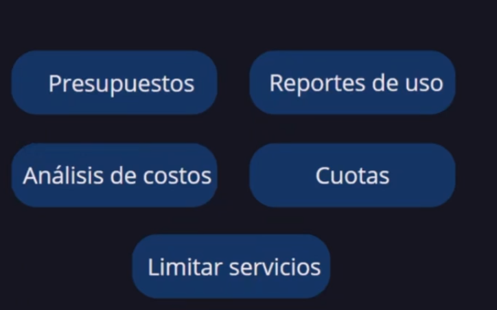
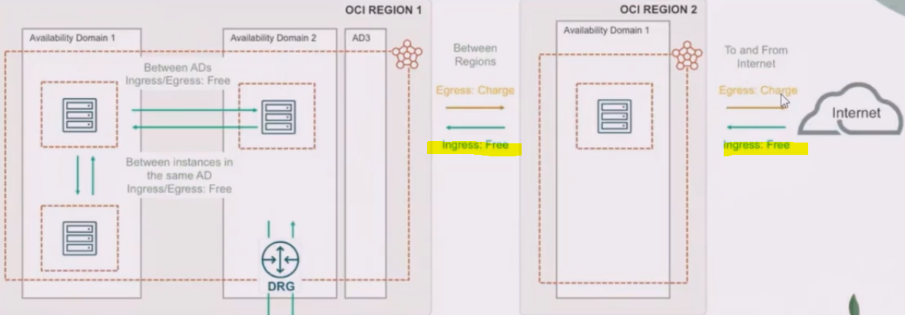
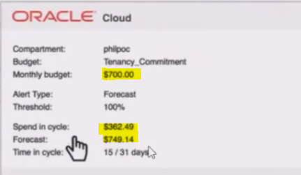
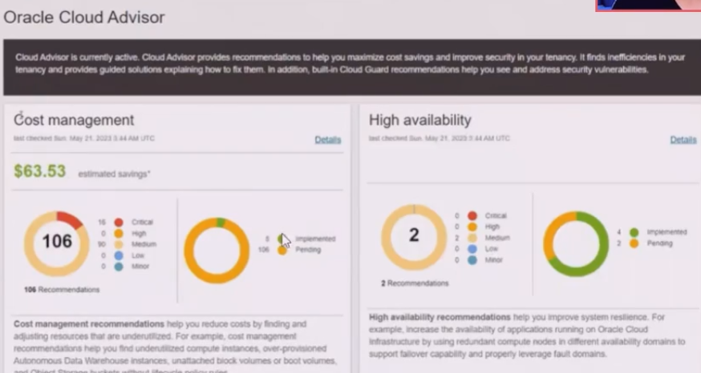
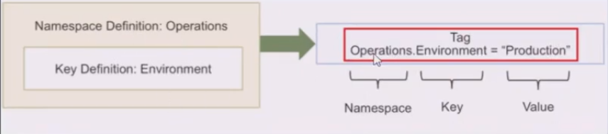

# Gobernanza y administración

## Precios

- simple
  - Pay as you go PAYG: solo se cobra lo usado
  - Annual universal credits: creditos disponibles en un año
  - Bring your own license BYOL: usa las licencias que ya tienes
- transparente
- menor precio

### Factores que impactan el precio

- tamaño de recursos
- transferencia de datos
- tipo de recurso, vms, bms, byol, dbs
- todas las regiones tienen el mismo precio
- 

## Manejo de costos Budgets - presupuestos

- se puede aplicar a compartimientos o etiquetas
- genera presupuestos asignados inclusive a los roles
- se configura al mes
- se pueden configurar alertas por correo por ejemplo, por % consumo o monto en $ consumidos
- oci te genera pronosticos de consumo

### Herramienta cost analysis

- se pueden agregar filtros
- muestra los recursos y sus costos consumidos
- forma visual que muestra en que se esta gastando el dinero
- muestra detalles

### Usage Reports - Reporte de uso

- puede generar reportes diarios en formato .csv

### Quotas - cuotas

- se pueden fijar topes

#### De compartimiento

- SET: numero maximo de recursos que un compartimiento puede usar
- Unset: restablece las cuotas a limite por defecto
- Zero: elimina el acceso a recursos del compartimiento

## Cloud Advisor

- herramienta o servicio
- es gratuito
- recomienda como modificar los costos
- da sugerencias en la gestion de costo
- ofrece recomendaciones para mejrar rendimiento
- ofrece recomendaciones para mejorar disponibilidad
- ofrece recomendaciones para la parte de seguridad

## Tagging

- o etiquetado
- los recursos pueden ser etiquetados
- usa pares llave-> valor
- se recomiendan etiquetas de ambientes: desarrollo, produccion, test o qa
- mejora la organizacion de los recursos
- ayuda en el manejo de costos
- tag based access control, asignacion de permisos por tag
- hay 2 opciones free-form tags, o defined tags
- se recomienda namespace=operations

